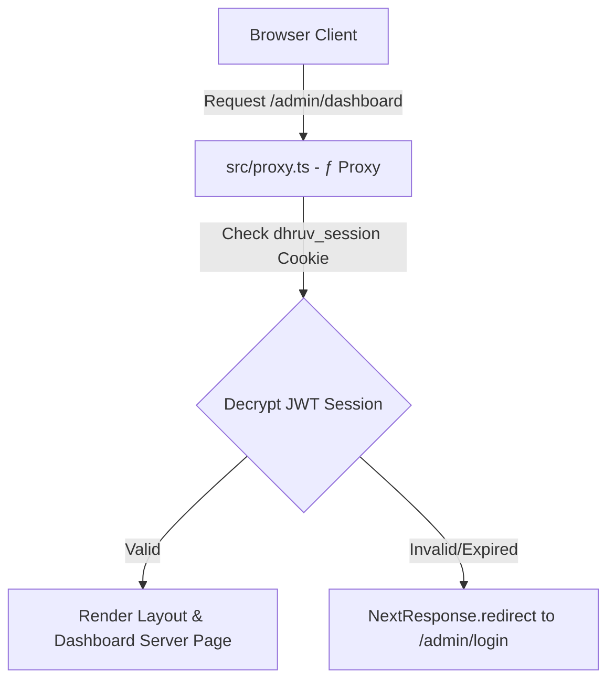

# Phase 1: 01 - Architecture Changes

This report documents the architectural adjustments made during Phase 1 to prepare the workspace for enterprise development.

## 1. Security Proxy Middleware Activation

- **The System Findings**: Next.js 16 introduces breaking changes, specifically deprecating the `middleware.ts` file convention in favor of a unified **`proxy.ts`** proxy middleware convention.
- **The Modification**: Refactored [src/proxy.ts](file:///d:/portfolio/src/proxy.ts) to utilize the central cookie name constant (`SESSION_COOKIE_NAME`) and verify sessions cleanly using `decryptSession` from [src/lib/auth.ts](file:///d:/portfolio/src/lib/auth.ts).
- **Architectural Flow**: Next.js compiles `src/proxy.ts` as `ƒ Proxy (Middleware)` and routes all matches matching `/admin/:path*` through it, validating session cookies and redirecting unauthorized operators before layout rendering or page component initialization occurs.

---

## 2. Centralized Configuration Provider

- **The Problem**: Settings default parameters and navigation lists were hardcoded across multiple files (such as `layout.tsx`, `ProjectsCMS.tsx`, `SettingsCMS.tsx`, and `seed.ts`).
- **The Modification**: Created [src/lib/constants.ts](file:///d:/portfolio/src/lib/constants.ts) to define navigation structures, default layout theme config variables, cookie names, and fallback emails in a single module.
- **Benefits**: Centralizes configuration variables, preparing the codebase for easy configuration changes.
