# Entity Relationship Diagram

## Overview

This document provides a visual representation of the database schema using a Mermaid ER diagram. The schema is intentionally flat — only one cross-table foreign key exists (skills → skill_categories).

## ER Diagram

```mermaid
erDiagram
    profiles {
        UUID id PK
        TEXT name
        TEXT title
        TEXT tagline
        TEXT bio
        TEXT contact_email
        TEXT location
        TEXT resume_url
        TIMESTAMPTZ created_at
        TIMESTAMPTZ updated_at
        TEXT status
    }

    skill_categories {
        UUID id PK
        TEXT name
        INTEGER position
        TIMESTAMPTZ created_at
        TIMESTAMPTZ updated_at
        TEXT status
    }

    skills {
        UUID id PK
        UUID category_id FK
        TEXT name
        INTEGER proficiency
        INTEGER position
        TIMESTAMPTZ created_at
        TIMESTAMPTZ updated_at
        TEXT status
    }

    skill_categories ||--o{ skills : "has many"

    projects {
        UUID id PK
        TEXT title
        TEXT slug
        TEXT subtitle
        TEXT role
        TEXT company
        TEXT timeline
        TEXT problem
        TEXT challenge
        TEXT solution
        JSONB tech_stack
        JSONB metrics
        JSONB screenshots
        TEXT github_url
        TEXT demo_url
        BOOLEAN is_featured
        BOOLEAN is_pinned
        BOOLEAN is_draft
        INTEGER position
        TIMESTAMPTZ created_at
        TIMESTAMPTZ updated_at
        TEXT status
    }

    experience {
        UUID id PK
        TEXT role
        TEXT company
        TEXT location
        TEXT timeline
        TEXT description
        INTEGER position
        TIMESTAMPTZ created_at
        TIMESTAMPTZ updated_at
        TEXT status
    }

    education {
        UUID id PK
        TEXT degree
        TEXT institution
        TEXT location
        TEXT timeline
        TEXT description
        INTEGER position
        TIMESTAMPTZ created_at
        TIMESTAMPTZ updated_at
        TEXT status
    }

    certificates {
        UUID id PK
        TEXT title
        TEXT issuer
        TEXT timeline
        INTEGER score
        TEXT suffix
        TEXT description
        INTEGER position
        TIMESTAMPTZ created_at
        TIMESTAMPTZ updated_at
        TEXT status
    }

    blogs {
        UUID id PK
        TEXT title
        TEXT slug
        TEXT content_markdown
        JSONB categories
        JSONB tags
        INTEGER reading_time
        BOOLEAN is_draft
        TIMESTAMPTZ published_at
        TIMESTAMPTZ created_at
        TIMESTAMPTZ updated_at
        TEXT status
    }

    testimonials {
        UUID id PK
        TEXT client_name
        TEXT client_role
        TEXT client_company
        TEXT text
        TEXT avatar_url
        INTEGER position
        TIMESTAMPTZ created_at
        TIMESTAMPTZ updated_at
        TEXT status
    }

    services {
        UUID id PK
        TEXT name
        TEXT description
        TEXT icon
        INTEGER position
        TIMESTAMPTZ created_at
        TIMESTAMPTZ updated_at
        TEXT status
    }

    seo {
        UUID id PK
        TEXT meta_description
        TEXT og_image
        TEXT twitter_card
        TIMESTAMPTZ created_at
        TIMESTAMPTZ updated_at
        TEXT status
    }

    site_settings {
        UUID id PK
        TEXT category
        TEXT key
        TEXT value
        TIMESTAMPTZ created_at
        TIMESTAMPTZ updated_at
        TEXT status
    }

    messages {
        UUID id PK
        TEXT name
        TEXT email
        TEXT objective
        TEXT details
        TEXT status
        TIMESTAMPTZ created_at
        TIMESTAMPTZ updated_at
    }

    analytics_events {
        UUID id PK
        TEXT event_type
        TEXT path
        TEXT referrer
        TEXT device
        TEXT country
        TEXT browser
        TIMESTAMPTZ created_at
    }
```

## Key Design Decisions

1. **Flat schema**: Most tables are independent entities. This simplifies CRUD operations and admin dashboard development.
2. **JSONB for arrays**: `tech_stack`, `metrics`, `screenshots`, `categories`, and `tags` use JSONB instead of junction tables, reducing query complexity for a single-tenant application.
3. **Soft-delete via `status`**: Records are never physically deleted from the database. The `status` field filters active records in RLS policies.
4. **UUID primary keys**: All tables use UUIDs for portability and to prevent enumeration attacks.
