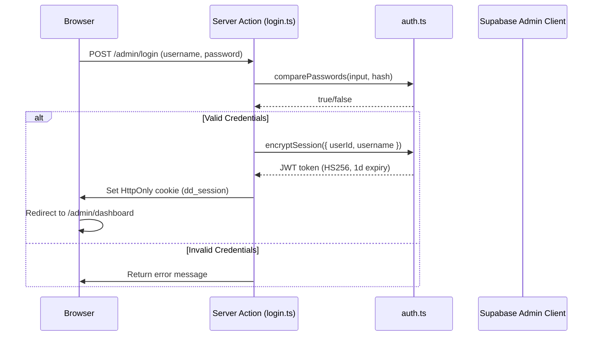

# Authentication Architecture

## Overview

Authentication uses a **hybrid approach**: JWT session management handled by custom application code, combined with Supabase's service role key for privileged database operations.

## Authentication Flow

## Session Management

### Cookie Configuration
- **Cookie name**: `dd_session` (defined in `src/lib/constants.ts`)
- **Algorithm**: HS256 via `jose` library
- **Expiration**: 24 hours from issuance
- **Storage**: HTTP-only cookie (not accessible via JavaScript)

### Session Verification
Every admin page calls `verifyAuthSession()` from `src/lib/auth.ts`:

1. Reads `dd_session` cookie from the request
2. Verifies the JWT signature using `ADMIN_JWT_SECRET`
3. Returns `UserSession` object (`{ userId, username }`) or `null`
4. On `null`, the page redirects to `/admin/login`

### Middleware (proxy.ts)
The `src/proxy.ts` file intercepts all `/admin/*` routes (except `/admin/login`) and verifies the session cookie at the edge, redirecting unauthenticated requests before they reach page components.

## Password Hashing
- **Library**: bcryptjs
- **Salt rounds**: 10
- **Storage**: Hashed passwords are stored server-side (not in Supabase for Phase 2)

## Security Notes

> [!IMPORTANT]
> The `ADMIN_JWT_SECRET` must be a strong, unique secret in production. The fallback key in the codebase is for development only.

> [!WARNING]
> Supabase Auth is not yet used for user authentication. The current system uses a custom JWT flow. Supabase Auth integration is planned for Phase 3 (Admin Dashboard).
