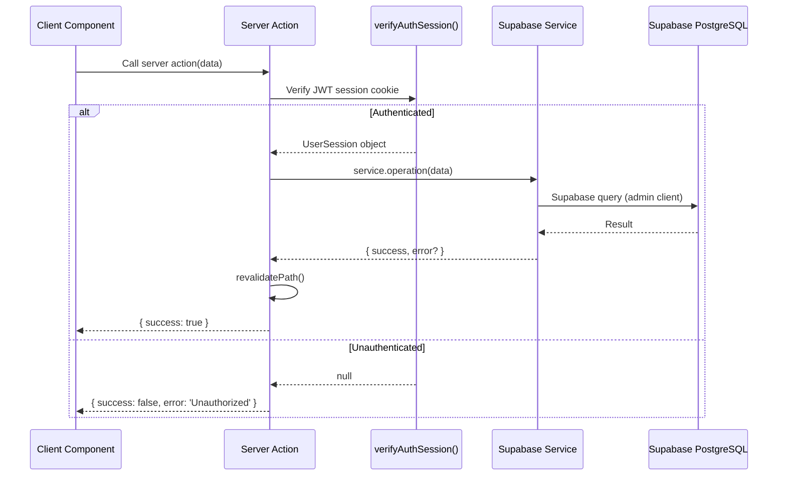

# API Architecture

## Overview

The portfolio uses Next.js **Server Actions** as its API layer instead of traditional REST API routes. Server Actions are invoked directly from client components and execute securely on the server.

## Server Action Inventory

| Action File | Functions | Service Dependency | Auth Required |
|---|---|---|---|
| `login.ts` | `loginAction` | `authService` / `auth.ts` | ❌ (login endpoint) |
| `blog.ts` | `saveBlogPost`, `deleteBlogPost` | `blogService` | ✅ |
| `projects.ts` | `saveProject`, `deleteProject` | `projectService` | ✅ |
| `settings.ts` | `saveSettings` | `settingsService` | ✅ |
| `contact.ts` | `submitContactForm` | `contactService` | ❌ (public form) |
| `messages.ts` | `updateMessageStatus`, `deleteMessage` | `contactService` | ✅ |

## Request Flow



## Authentication Guard

All admin Server Actions follow this pattern:

```typescript
export async function adminAction(data: any) {
  const session = await verifyAuthSession();
  if (!session) {
    return { success: false, error: 'Unauthorized administrative operation.' };
  }
  // ... perform operation
}
```

## Cache Invalidation

After successful mutations, Server Actions call `revalidatePath()` to invalidate Next.js cache for affected routes:

```typescript
revalidatePath('/admin/dashboard');
revalidatePath('/admin/projects');
revalidatePath('/');  // Public homepage
```

## Public Actions

The `contact.ts` action does not require authentication — it allows anonymous visitors to submit contact forms. It includes:
- Input validation (name, email, objective, details)
- Sanitization of user input
- Rate limiting considerations (planned)

## Error Response Contract

All actions return a consistent shape:

```typescript
{ success: true }
// or
{ success: false, error: 'Human-readable error message' }
```
