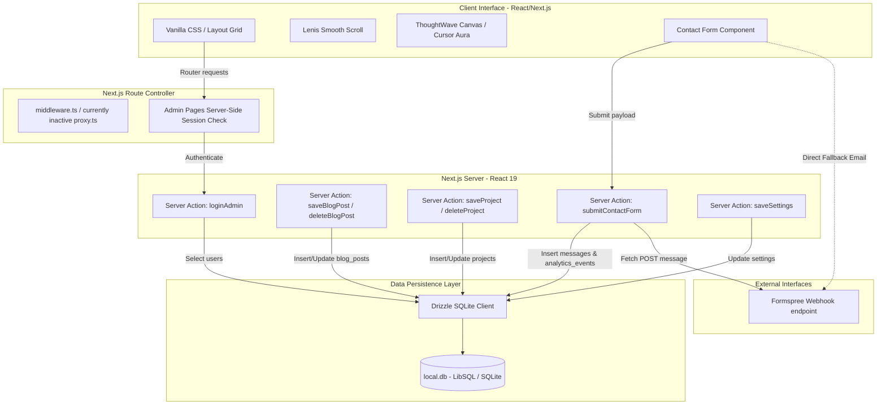
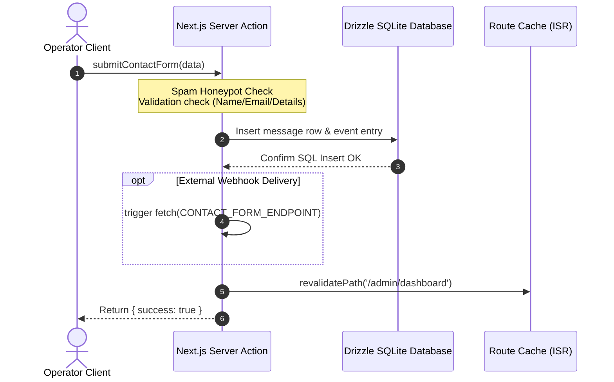

# Project Audit: 01 - Application Architecture

This report details the architectural blueprint of the Applied AI Portfolio engine.

## 1. Architectural System Diagram

---

## 2. Infrastructure Component Breakdown

### 2.1 Client
- **Tech Stack**: React 19.2.4 & Next.js 16.2.10 (App Router).
- **Styling**: Vanilla CSS utilizing custom tailwind directives (`@import "tailwindcss"`) and variables bound dynamically to React state via [src/components/ThemeProvider.tsx](file:///d:/portfolio/src/components/ThemeProvider.tsx).
- **Core Interactions**: 
  - Smooth animation interpolation via [Lenis](file:///d:/portfolio/src/components/LenisProvider.tsx).
  - Neural visual modeling via [ThoughtWave](file:///d:/portfolio/src/components/ThoughtWave.tsx) Canvas.
  - Spotlight coordinate tracking via [LightProbe](file:///d:/portfolio/src/components/LightProbe.tsx) cursor auric gradients.

### 2.2 Server
- **Tech Stack**: Next.js App Router acting as a Node.js runtime host.
- **Server Actions**: Serves as the primary transaction layer for writing database changes and revalidating public layouts immediately without page reloads.

### 2.3 API
- **Endpoint Design**: Utilizes type-safe Server Actions (`"use server"`) instead of traditional REST endpoint handlers. This reduces route configuration boilerplate but limits native cross-origin external API calls without customized CORS header routing.

### 2.4 Database
- **Engine**: SQLite / LibSQL hosted in local workspace (`local.db`).
- **Client**: `drizzle-orm` (configured in [drizzle.config.ts](file:///d:/portfolio/drizzle.config.ts) and initialized in [src/db/index.ts](file:///d:/portfolio/src/db/index.ts)).

### 2.5 Authentication & Authorization
- **Verification Flow**: Compares credentials against hashed password parameters using `bcryptjs` and signs lightweight session tokens using `jose`. Tokens are written into HttpOnly, Secure, Lax session cookies.

### 2.6 Third-Party Integrations
- **Formspree / Web3Forms**: Contact form submission redirects to `CONTACT_FORM_ENDPOINT` if configured in the environment variables, ensuring email delivery fallback.

---

## 3. Data Flow Model

- **Static Site Regeneration**: When dynamic elements (settings, projects, blogs) are updated inside the Admin panel, paths are revalidated instantly using `revalidatePath` to refresh the ISR Cache structure.
