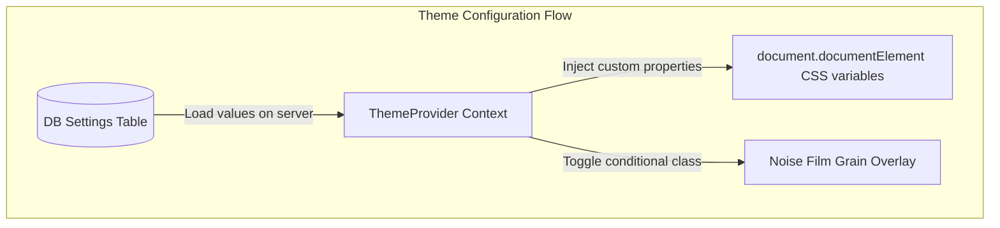

# Project Audit: 03 - Frontend Audit

This report details the frontend engineering, components structure, and rendering pipelines.

## 1. Technical Framework Analysis

- **Core Library**: **React 19.2.4** (with native support for asynchronous Server Actions, hooks updates, and client/server component isolation).
- **Meta-Framework**: **Next.js 16.2.10** (leveraging modern App Router layout configurations).
- **Styling Paradigm**: Vanilla CSS combined with **Tailwind CSS v4** (using custom `@import "tailwindcss"` injection in [src/app/globals.css](file:///d:/portfolio/src/app/globals.css)).
- **Rendering Strategy**:
  - **Incremental Static Regeneration (ISR)** / **Static Server-Side Rendering (SSR)**: The landing page [src/app/page.tsx](file:///d:/portfolio/src/app/page.tsx) and blog routes query data directly from SQLite at build time or request time.
  - **On-Demand Cache Revalidation**: Server actions use `revalidatePath` to trigger instant cache clearance across public layout folders (e.g. `/`, `/blog`, `/admin/projects`) when an operator performs database modifications.

---

## 2. Layouts and Navigation Structures

### 2.1 Navigation Model
- **Public Header**: Configured in the root layout [src/app/layout.tsx](file:///d:/portfolio/src/app/layout.tsx). It uses a sticky flexbox wrapper with pointer-events adjustments (`pointer-events-none` on parent, `pointer-events-auto` on link tags) to avoid blocking interactions with custom canvas animations behind the text.
- **Admin Sidebar Navigation**: Placed inside [src/app/admin/layout.tsx](file:///d:/portfolio/src/app/admin/layout.tsx), providing unified dashboard shortcuts:
  - `/admin/dashboard` (KPI Analytics)
  - `/admin/projects` (Projects CMS)
  - `/admin/blog` (Writing CMS)
  - `/admin/messages` (Inbound Leads)
  - `/admin/settings` (System visual configurations)

---

## 3. Interaction Mechanics & Animations

### 3.1 Custom Animation Components
- **Neural Motion wave (ThoughtWave)**: Implemented in [src/components/ThoughtWave.tsx](file:///d:/portfolio/src/components/ThoughtWave.tsx) using a canvas element animated via `requestAnimationFrame` using trigonometric sine and cosine functions.
- **Light Spotlight Aura (LightProbe)**: Tracked dynamically in [src/components/LightProbe.tsx](file:///d:/portfolio/src/components/LightProbe.tsx) by binding coordinates on the `mousemove` window callback, computing positions with linear interpolation (Lerp multiplier: `0.08`), and rendering spotlight effects using CSS radial-gradients.
- **Apple-like Soft Smooth Scrolling**: Enabled in [src/components/LenisProvider.tsx](file:///d:/portfolio/src/components/LenisProvider.tsx) via Lenis smooth scrolling (Easing function: `t => Math.min(1, 1.001 - Math.pow(2, -10 * t))`).

---

## 4. Typography, Iconography, and Theme Design System

- **Fonts Integration**: Uses `next/font/google` in [src/app/layout.tsx](file:///d:/portfolio/src/app/layout.tsx):
  - **Sans-Serif**: `Plus_Jakarta_Sans` (weight scale: 300 to 700) bound to CSS variable `--font-sans`.
  - **Serif**: `Instrument_Serif` (featuring unique italic configurations) bound to `--font-serif`.
  - **Monospace**: `JetBrains_Mono` bound to `--font-mono`.
- **Dynamic Theming**: Custom CSS properties are injected on `document.documentElement` dynamically during `useEffect` triggers in [src/components/ThemeProvider.tsx](file:///d:/portfolio/src/components/ThemeProvider.tsx):
  - `--bg` (mapped to `colorBg`)
  - `--surface` (mapped to `colorSurface`)
  - `--text` (mapped to `colorText`)
  - `--text-muted` (mapped to `colorTextMuted`)
  - `--accent` & `--accent-rgb` (mapped to `colorAccent`)
  - `--radius` (mapped to `radius`)
  - Dynamic `showNoise` enables overlaying a fine cinematic film grain background.
- **Internationalization**: Not configured. All string copy is written statically in English.
- **Accessibility features**: Includes `reduceMotion` configs. When enabled, it appends a global helper class `.reduce-motion` that forces animation delays/durations to `1ms` and overrides Lenis smooth scrolling.
