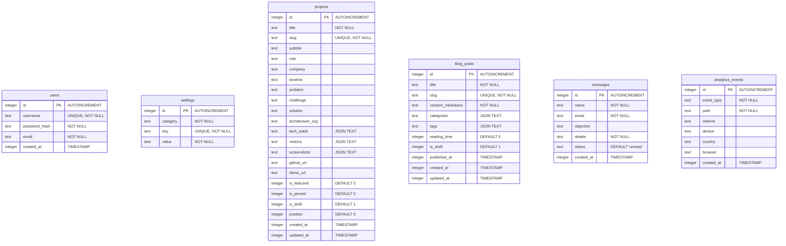

# Project Audit: 05 - Database Audit

This report details the SQLite relational schema design, Drizzle definitions, and performance indices.

## 1. Relational ER Diagram

---

## 2. Table Schemas Detailed Inspection

All tables are defined in [src/db/schema.ts](file:///d:/portfolio/src/db/schema.ts) using Drizzle SQLite Core abstractions.

### 2.1 `users`
- **Purpose**: Stores encrypted credentials for administrative operator accounts.
- **Constraints**: `username` is UNIQUE.

### 2.2 `settings`
- **Purpose**: Key-Value parameters holding UI settings.
- **Constraints**: `key` is UNIQUE. Category can be `'hero' | 'theme' | 'seo' | 'animations'`.

### 2.3 `projects`
- **Purpose**: Project case studies and metadata.
- **Data Serialization**: `techStack`, `metrics`, and `screenshots` store serialized JSON text arrays/objects (e.g. `["Next.js","pgvector"]`).

### 2.4 `blog_posts`
- **Purpose**: Technical essays.
- **Serialization**: `categories` and `tags` store serialized JSON text arrays.

### 2.5 `messages`
- **Purpose**: Inbound contact submissions from the landing page.
- **States**: `status` field defaults to `'unread'`, and can be updated to `'read' | 'archived' | 'spam'`.

### 2.6 `analytics_events`
- **Purpose**: Simple interaction tracking (referrers, paths, device types).

---

## 3. Database Normalization & Performance Audit

### 3.1 Normalization State
- The database is mostly in **3NF** (Third Normal Form). 
- Lists such as technology tags, metrics arrays, and image paths are stored as serialized JSON strings within text fields (e.g., `projects.techStack`). While standard practice for simple SQLite setups, this prevents performant querying of projects by a specific technology tag using pure SQL indexing.

### 3.2 Key Index Vulnerabilities
- **Missing Secondary Indexes**: 
  - There are **no manual secondary indexes** configured on query filters in the schema.
  - Queries filtering blog posts (`isDraft = 0`) and projects (`isDraft = 0`, sorted by `position`) execute full table scans.
  - While negligible at low volumes (e.g., less than 1,000 entries), if the blog directory scales, query performance will benefit from an index on `(is_draft, created_at)`.
