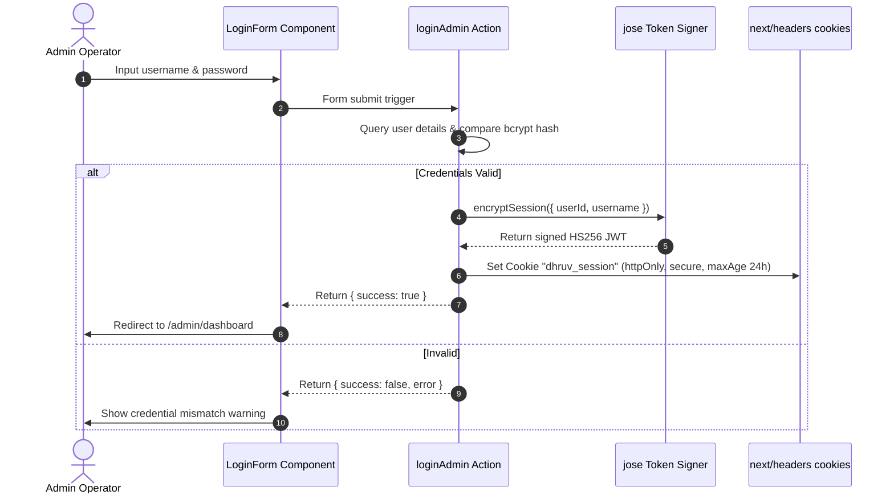

# Project Audit: 06 - Authentication

This report details the authentication workflow, session storage, and security mechanisms.

## 1. Authentication Configuration

The core authentication system is defined in [src/lib/auth.ts](file:///d:/portfolio/src/lib/auth.ts).

- **Encryption**: Uses **`bcryptjs`** for password hashing.
  - Password Hashing: `hashPassword(password)` sets a work factor salt of `10` rounds (`bcrypt.genSalt(10)`).
  - Password Comparison: `comparePasswords(password, hash)` verifies submitted plain text strings.
- **Session Tokens**: Implemented via JSON Web Tokens (JWT) using the **`jose`** library.
  - Encryption Secret: Loaded from `process.env.ADMIN_JWT_SECRET` (falls back to a hardcoded string `DHRUV_PORTFOLIO_SECURE_SECRET_FALLBACK_KEY_2026` if not configured).
  - Algorithm: **`HS256`** (HMAC using SHA-256).
  - Expiration: **1 day** (`1d`).

---

## 2. Session Lifecycle & Token Management

### 2.1 Cookie Parameters
The session cookie is configured in [src/app/actions/login.ts:L43](file:///d:/portfolio/src/app/actions/login.ts#L43):
- Name: **`dhruv_session`**
- Parameters:
  - `httpOnly: true` (Blocks access from client-side scripts to mitigate XSS attacks).
  - `secure: process.env.NODE_ENV === 'production'` (Transmits cookie only over secure HTTPS in production).
  - `sameSite: 'lax'` (Provides CSRF protection for cross-site requests).
  - `maxAge: 60 * 60 * 24` (Expires after 24 hours).

### 2.2 Sign-out Execution
Sign-out deletes the session cookie immediately via the `logoutAdmin` Server Action in [src/app/actions/login.ts:L58](file:///d:/portfolio/src/app/actions/login.ts#L58).

---

## 3. Security Analysis

- **Verification Bypass Risk**: As documented in the Backend Audit, Next.js Middleware (`src/proxy.ts`) is currently bypassed. Authentication checks rely on page-level checks using `verifyAuthSession()`. If an engineer creates a new `/admin/` subpage and forgets to verify the session, the page will render publicly.
- **Static Secret Fallback**: If `ADMIN_JWT_SECRET` is not specified in the active `.env` file, the system falls back to `DHRUV_PORTFOLIO_SECURE_SECRET_FALLBACK_KEY_2026`. This static fallback increases risk if the project is open-sourced or checked into a public repository.
- **Account Creation**: The application lacks user registration pages (`/admin/register` is "Not Found"). New operator creation is managed via the seed script [src/db/seed.ts:L23](file:///d:/portfolio/src/db/seed.ts#L23) when resetting the database.
- **Password Reset / MFA / OAuth**: "Not Found."
