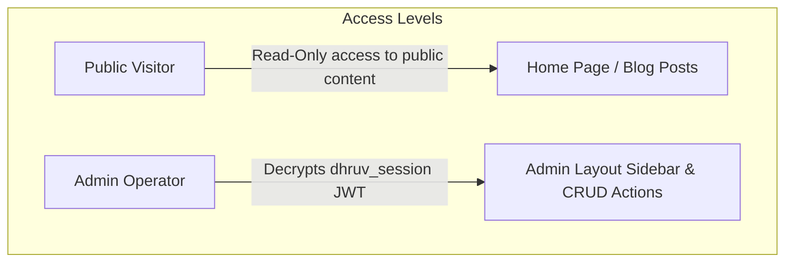

# Project Audit: 07 - Authorization System

This report audits access controls, role definitions, and permission boundaries.

## 1. System Role Hierarchy

The authorization design is currently **single-tenant**. The database schema [src/db/schema.ts](file:///d:/portfolio/src/db/schema.ts) does not declare roles (e.g. `'superadmin'`, `'editor'`) or permission groups on the `users` table.



- **Visitor Permissions**: Has read-only access to published blog articles, case studies, and visual canvas elements.
- **Admin Permissions**: Has full write access. Can modify system settings, create projects, edit journal articles, and delete lead records.

---

## 2. Server Action Permission Verification

All administrative operations (in [src/app/actions/](file:///d:/portfolio/src/app/actions/)) verify authorization by validating the session before executing mutations:

```typescript
// Sample verification from src/app/actions/blog.ts
const session = await verifyAuthSession();
if (!session) {
  return { success: false, error: 'Unauthorized administrative operation.' };
}
```

### 2.1 Audited Actions
- `saveBlogPost` & `deleteBlogPost`
- `deleteMessage` & `updateMessageStatus`
- `saveProject`, `deleteProject`, & `updateProjectOrder`
- `saveSettings`

---

## 3. Authorization Risks

1. **Missing Role Mapping**:
   - The application does not support granular roles (e.g., separating an `'editor'` who can draft posts from an `'admin'` who can delete messages). Any account successfully logged into the `users` table gains full administrative access.
2. **Missing Row-Level Security**:
   - The SQLite database engine lacks native row-level security or tenancy constraints. Access control is managed entirely at the application server layer.
3. **Admin Directory Protection**:
   - Because [src/proxy.ts](file:///d:/portfolio/src/proxy.ts) is not loaded as a Next.js middleware, there is no global filter preventing the browser from attempting to render `/admin/dashboard` components before authentication is confirmed. Page server files must manually call `verifyAuthSession()` and trigger `redirect('/admin/login')` to secure each view.
