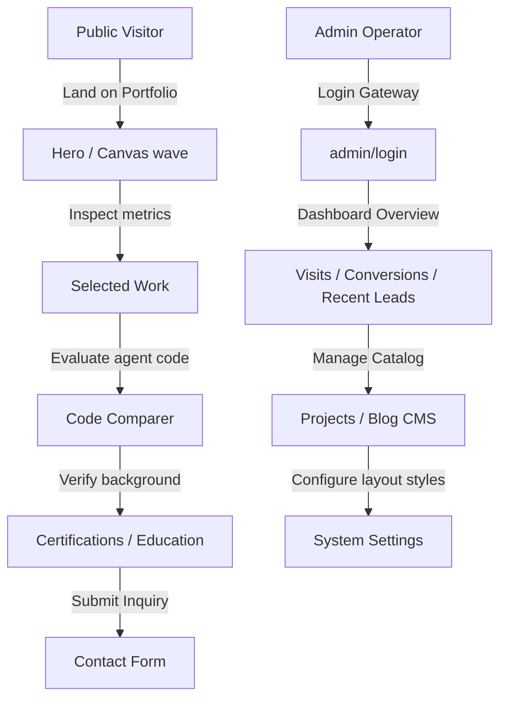

# Project Audit: 09 - User System

This report details the user journey workflows, account properties, and visual controls.

## 1. User Classification

The application recognizes two user roles:
1. **Public Visitor**: The client, partner, recruiter, or developer inspecting the portfolio.
2. **Admin Operator**: The systems engineer managing copy content, database status items, and themes.

---

## 2. Public Visitor Journey & Interaction Points

- **Identity Inspection**: Visitors land on the primary hero viewport. Text styles and descriptions are served directly from settings configured by the operator.
- **Projects Catalog**: Displays published case studies sorted by `position` order.
- **Agent Comparison**: Allows visitors to toggle between code versions to evaluate agentic pipeline structures.
- **Contact Form Entry**: Validates input data (checks name character lengths, confirms email patterns, and enforces detail limits) before logging message entries. Programmatic honeypot scripts screen out automated bot submissions.

---

## 3. Account Specifications

- **Registration Workflow**: "Not Found." Registration pages are omitted. Accounts are provisioned directly in the database using seeds.
- **Account Attributes**:
  - `id` (integer, Primary Key)
  - `username` (text, unique)
  - `email` (text)
  - `passwordHash` (text, bcrypt verified)
- **Profile / Billing / Subscriptions / System Notifications**: "Not Found." The system does not connect to billing gateways (e.g. Stripe) or dispatch web notifications.
- **Operational Logs**: Messages received are categorized under status states (`unread`, `read`, `archived`, `spam`) but change history logs are not maintained.
