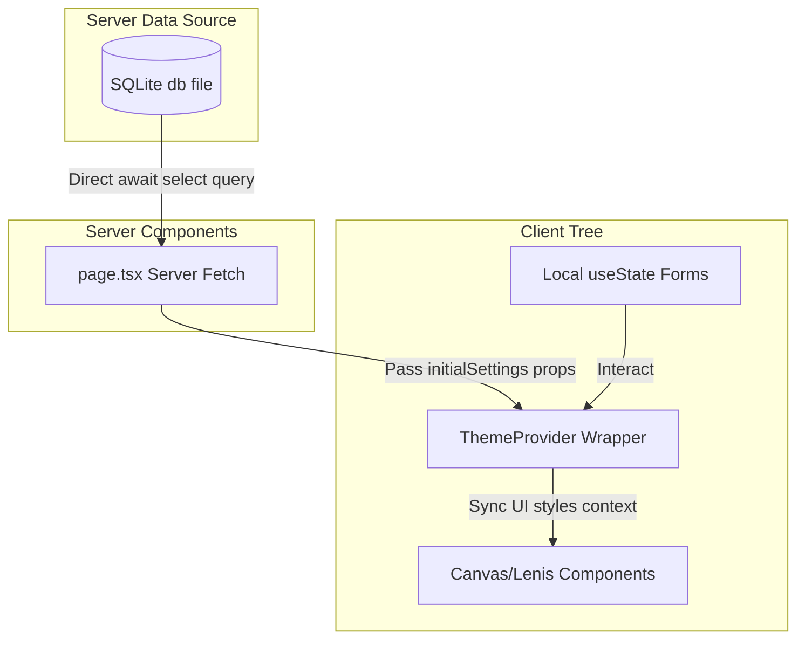

# Project Audit: 11 - State Management

This report details how client and server-side states are synchronized across pages.

## 1. State Management Paradigm

The application avoids heavy global state management libraries (e.g., Redux, Zustand, Jotai). Instead, it relies on a hybrid model:
1. **Server State Persistence**: SQLite acts as the source of truth, queried directly during server component runs.
2. **Dynamic Configuration Context**: A lightweight React Context provider [src/components/ThemeProvider.tsx](file:///d:/portfolio/src/components/ThemeProvider.tsx) propagates styling preferences down the component tree.
3. **Local Component State**: Managed via standard React `useState` hooks for form validation, tab selection, and dialog status.



---

## 2. Global State context (ThemeProvider)

The `ThemeProvider` context is defined in [src/components/ThemeProvider.tsx](file:///d:/portfolio/src/components/ThemeProvider.tsx).

- **Initial State**: Fetches global configs from the server database, merges them with defaults, and passes them as `initialSettings` during bootstrap.
- **Dynamic Updates**:
  ```typescript
  const [settings, setSettings] = useState<ThemeConfig>(initialSettings);
  const updateSettings = (newSettings: Partial<ThemeConfig>) => {
    setSettings((prev) => ({ ...prev, ...newSettings }));
  };
  ```
- **CSS Variable Injection**: Runs a `useEffect` hook to map state values to global CSS variables on `document.documentElement` (e.g. `--bg`, `--surface`, `--accent`).
- **Re-render Profile**: The `ThemeProvider` context wraps the layout child tree in `layout.tsx`. Changes to visual styles trigger component updates across the subtree. However, because properties are updated infrequently (only during settings saves), runtime overhead remains low.

---

## 3. Local State Audits

- **`CodeComparer.tsx`**: Uses local state (`useState<StepType>('naive')`) to control current tabs and display matching code files.
- **`ContactForm.tsx`**: Uses `useState` hooks to track:
  - Form field values.
  - Form validation states (`errors`, `hasAttemptedSubmit`).
  - Request execution states (`idle`, `submitting`, `success`, `error`).
- **CMS Portals (`BlogCMS`, `ProjectsCMS`, `SettingsCMS`)**: Use local state states to hold table filters, form states, and confirmation alerts.
- **Caching & Hydration**:
  - The application relies on Next.js's native cache validation.
  - When server actions run successfully, they execute `revalidatePath()`. This triggers Next.js to regenerate the matching pages, updating the client view upon reload.
  - Client state persistence (e.g., local storage) is not configured.
