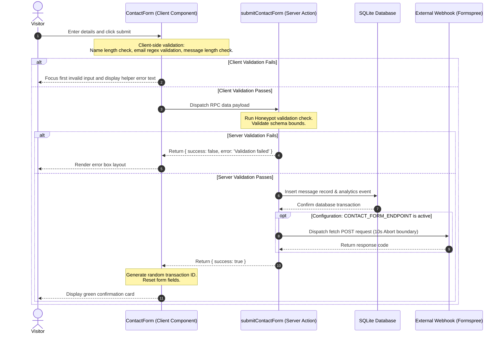
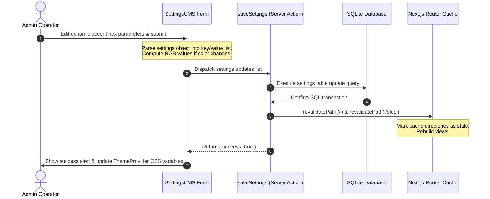

# Project Audit: 12 - Data Flow

This report details data flow sequences for transactions, updates, and layout synchronization.

## 1. Contact Form Submission Flow

---

## 2. Dynamic Settings Update Flow

---

## 3. Realtime Updates, Retries, & Optimistic UI

- **Realtime Support**: **Not Configured.** The application does not use WebSockets, Server-Sent Events, or polling models (e.g. SWR/TanStack query polling). Visitors must manually refresh their browsers to fetch new blog articles or updated case studies.
- **Optimistic Updates**: **Not Configured.** The CMS panels display loading states during Server Action execution and wait for database transaction confirmations before updating list views.
- **Retry Mechanics**: Client forms do not implement automated retry policies on network failures. However, the external webhook forwarder inside [src/app/actions/contact.ts](file:///d:/portfolio/src/app/actions/contact.ts) features a `10-second` timeout boundary to prevent request hangs.
